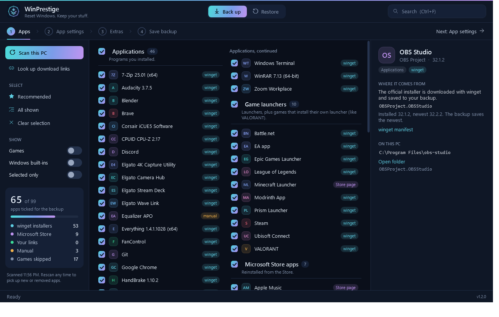
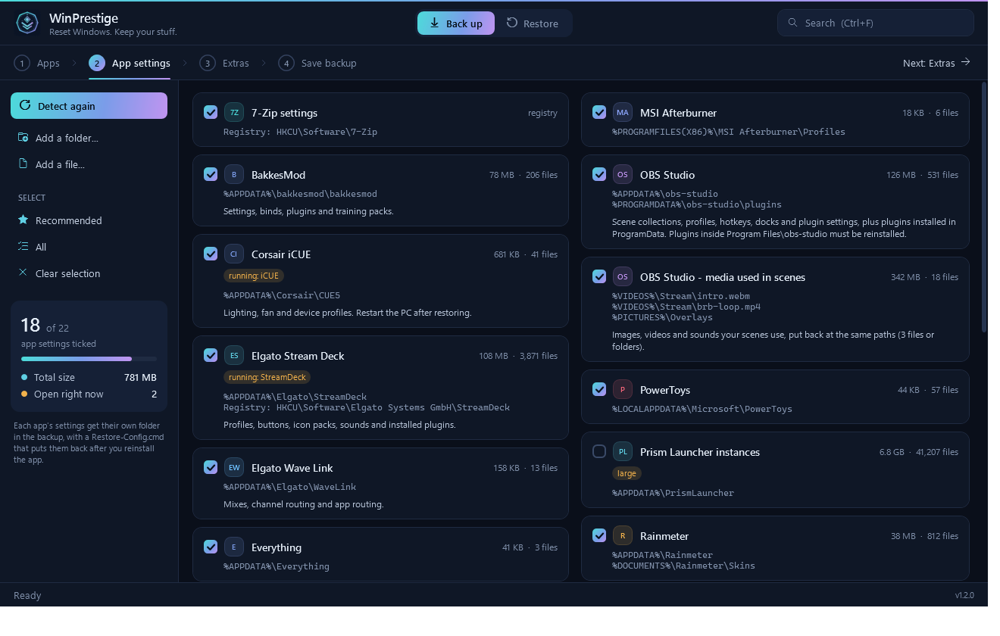
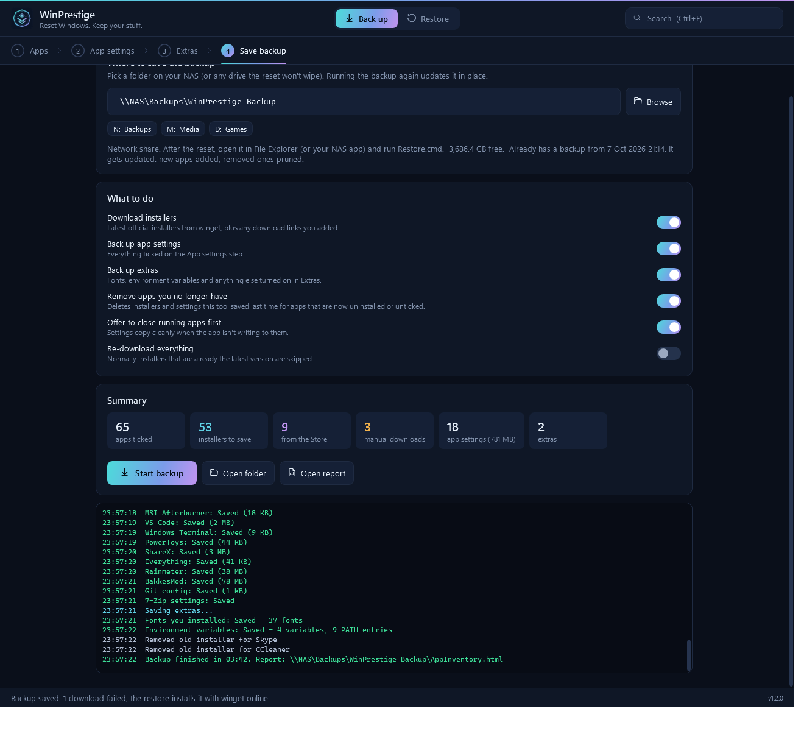
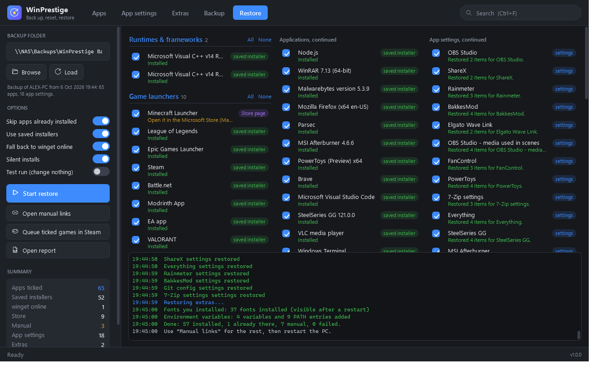

<p align="center">
  
</p>

<h1 align="center">WinPrestige</h1>

<p align="center"><b>Reset Windows. Keep your stuff.</b><br>
Back up your apps, their installers and their settings before a reset, then put everything back with one click.</p>

<p align="center">
  
</p>

---

Reinstalling Windows is easy. Rebuilding your setup afterwards isn't: remembering every app, finding the real download pages, and redoing your OBS scenes, fan curves and Stream Deck profiles. WinPrestige does that for you.

- **Scans your PC** with the registry, winget and the Microsoft Store, and sorts everything into apps, launchers, Store apps, drivers, runtimes, games and Windows built-ins.
- **Skips games, keeps launchers.** Steam, Epic, Battle.net and the rest stay in. Games that install their own launcher, like VALORANT and League of Legends, count as launchers.
- **Saves the latest official installers** to a folder or NAS share, using [winget](https://learn.microsoft.com/windows/package-manager/). winget records each vendor's own download link and checks the file against a SHA-256 hash.
- **Backs up app settings** for about 50 apps, including OBS (scenes, profiles and the media your scenes use), FanControl, Elgato Stream Deck and Wave Link, Corsair iCUE, Logitech G HUB, SteelSeries GG, NZXT CAM, SignalRGB, BakkesMod, Wallpaper Engine, Minecraft worlds, Adobe presets and Windows Terminal. You can add any other folder too.
- **Extras:** fonts you installed, environment variables, and optionally Wi-Fi networks, drivers and your user folders.
- **Restores everything** in one batch, silently. Simple installers run three at a time and MSI-based ones run one by one at the end. If a saved installer fails, winget installs the app online instead. Your settings go back in place, even if your Windows user name changes.
- **Finds your backup** on a fresh copy of WinPrestige, and **picks up where it left off** if the PC restarts mid-restore.
- **Stays up to date.** Run it again before the reset and it downloads only newer installers, adds new apps, and removes ones you've uninstalled.
- **Writes a report** (`AppInventory.html`) listing every app, how it comes back, and its official download link.

Everything runs on your PC. WinPrestige has no account, no telemetry, and sends nothing anywhere except the downloads you ask for.

## Screenshots

| App settings | Backup | Restore |
| --- | --- | --- |
|  |  |  |

## Download

**Option 1:** Download `WinPrestige.zip` from [Releases](https://github.com/ohHeyItsCon/winprestige/releases), unzip it, and run `WinPrestige.exe`.

**Option 2:** Paste this into PowerShell:

```powershell
irm https://raw.githubusercontent.com/ohHeyItsCon/winprestige/main/install.ps1 | iex
```

Windows asks for administrator rights, which installing apps needs. The exe isn't code-signed yet, so SmartScreen may say "Windows protected your PC". Click **More info**, then **Run anyway**, or use `WinPrestige.cmd` instead.

Requirements: Windows 10 or 11. winget (App Installer) is used when available; without it, apps are read from the registry only.

## Before the reset

1. **Apps:** the scan runs on its own. Click an app to see where its installer comes from. Apps tagged `manual` had no winget or Store package: pick one of the suggested matches or paste a direct download link.
2. **App settings:** tick what to keep. Very large folders, like modpack instances and browser profiles, start unticked.
3. **Extras:** turn on fonts, Wi-Fi, drivers or user folders as needed.
4. **Backup:** choose a folder the reset won't wipe (a NAS share works well), then press **Start backup**.

## After the reset

Either way works:

- **Freshly downloaded WinPrestige:** it looks for backups on your other drives, USB drives, mapped network shares, and Desktop, Documents and Downloads. If it finds one, press **Restore everything**, or **Review first** to choose what to reinstall. If not, press **Find my backup...** and pick the folder, or drag the backup folder onto the window.
- **From the backup itself:** open the backup folder on your NAS or external drive and double-click `Restore.cmd`.

The restore runs in one batch:

1. Shared runtimes the installers need, such as .NET.
2. Simple silent installers, three at a time (turn off **Install several at once** to go one by one).
3. Winget and Microsoft Store installs, and any installer that needs clicking through.
4. MSI-based installers, one at a time, at the end.
5. Your app settings and extras.

If an installer clashes with another one running at the same time, it gets retried on its own. Afterwards, use **Open manual links** for anything that needs a manual download, and restart the PC.

If the PC restarts in the middle, WinPrestige opens again after you sign in and offers to **Continue restore** with whatever's left.

If the admin window can't reach a network share, WinPrestige offers to sign in to it for you.

## What's in a backup

| Path | Contents |
| --- | --- |
| `Restore.cmd` | Opens WinPrestige on the Restore tab with this backup loaded |
| `AppInventory.html` / `.csv` | Every app found, how it comes back, and its official download link |
| `Installers\<App>\` | The installer plus winget's manifest |
| `Installers\_Dependencies\` | Shared runtimes the installers need, such as .NET |
| `Configs\<App>\` | That app's settings, plus `Restore-Config.cmd` to restore them on their own |
| `Extras\` | Fonts, environment variables, Wi-Fi profiles, drivers, user folders |
| `WinPrestige\` | A copy of the app, so it's there after the reset |
| `manifest.json` | What the restore reads |

Some backups contain private data, such as browser profiles, SSH keys, Wi-Fi passwords and RustDesk settings. Those are marked in the app and start unticked. Keep your backup folder somewhere only you can read.

## Adding support for more apps

- [`data/profiles.json`](data/profiles.json) lists where each app keeps its settings. Add an entry with the folders, files or registry keys to copy and the processes to close, and open a pull request.
- [`data/rules.json`](data/rules.json) decides what counts as a game, launcher, runtime or built-in.

## Building

```powershell
.\build.ps1 -Version 1.0.1
```

This compiles `WinPrestige.exe` from [`src/Launcher.cs`](src/Launcher.cs) with the C# compiler that ships with Windows, and creates `dist\WinPrestige.zip` for a release. The app itself is plain PowerShell (`WinPrestige.ps1` and `lib\`), with a WPF interface inspired by Chris Titus Tech's [WinUtil](https://github.com/ChrisTitusTech/winutil).

App settings and caches are kept in `%LOCALAPPDATA%\WinPrestige`, with a log file for each day.

## License

[MIT](LICENSE)
